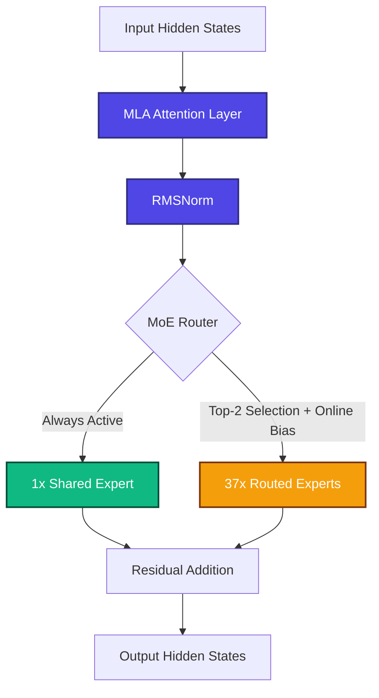
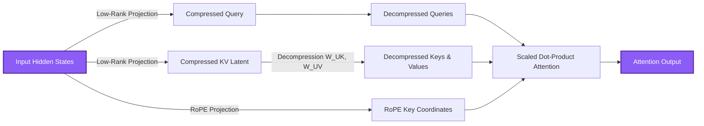

# 🚀 KT_GPT: Sparse Mixture-of-Experts at Sub-200M Active Capacity

<div align="center">

[](https://github.com/)
[](https://github.com/)
[](https://github.com/)
[](https://github.com/)

---

**An educational research exploration in high-sparsity, sub-200M active parameter Mixture-of-Experts language models.**

</div>

---

## 📌 Educational Focus
> [!NOTE]
> **Purpose & Scope:**
> This repository is built purely for **educational and self-learning purposes** to implement, explore, and understand the mechanics of advanced Transformer architectures at a manageable scale. It acts as an open playground for modern techniques pioneered by frontier models like DeepSeek-V2/V3.

---

## 🏗️ Architecture Visualization

### 1. Mixture-of-Experts (MoE) Routing Flow
KT_GPT decouples capacity from compute by routing tokens through an always-active Shared Expert and dynamically selecting top-2 of 37 specialized Routed Experts using an online bias load-balancing mechanism:



### 2. Multi-head Latent Attention (MLA) Low-Rank Cache
Standard MHA consumes vast amounts of GPU VRAM caching Keys and Values. MLA projects Keys and Values into a shared compressed low-rank latent space ($\mathbf{d_c} = 128$) to keep the cache footprint ultra-low:



---

## 🛠️ KT_GPT Core Specifications

| Dimension | Specification | Description |
| :--- | :---: | :--- |
| **Hidden Dimension ($d_{model}$)** | **704** | Main representation layer size |
| **Number of Layers** | **36** | Deep layers to capture abstract coding representations |
| **Vocab Size** | **32,000** | Tokenized using `mistralai/Mistral-7B-v0.1` |
| **Context Length** | **4,096** | Extended token context window supported in Phase 2 |
| **Attention Mechanism** | **MLA** | Low-rank query and KV cache compression |
| **FFN Activation** | **SwiGLU** | Gated Swish Feed-Forward Network per expert |
| **Routed Experts ($N_{routed}$)** | **37** | Top-2 selected dynamically per token per layer |
| **Shared Experts ($N_{shared}$)** | **1** | Always-active base structural representation layer |

---

## 📊 Verified Parameter Count Breakdown

Verify these counts programmatically at any time by running:
```bash
python -m scripts.count_params
```

```text
============================================================
  KT_GPT Parameter Count Breakdown
============================================================
  Embeddings (weight-tied):        22.53M

  --- Per Layer (36 layers) ---
  MLA Attention:                   1.24M
  Single Expert (SwiGLU):          0.68M
  Shared Expert(s) [1]:            0.68M
  Routed Experts [37]:             25.01M
  Router Linear:                   0.03M
  Layer Norms (2x RMSNorm):        0.00M
  Layer Total:                    26.95M

  --- Totals ---
  All Layers:                    970.15M
  Final RMSNorm:                   0.00M
  Embeddings:                     22.53M
  ─────────────────────────────────────
  Total Parameters:              992.68M
  Active Parameters / token:     141.12M
  Sparsity:                      85.8%
  KV Cache / token / layer:      160 values (vs 1,408 for standard MHA)
============================================================
```

---

## 📈 Pretraining & Fine-Tuning Pipeline

Our roadmap follows a staged training process to build capabilities incrementally on a limited budget:

```mermaid
gantt
    title Model Training Pipeline
    dateFormat  X
    axisFormat %d
    section Pretraining
    Phase 1 Foundation (1B Tokens) :active, p1, 0, 15
    Phase 2 Code Expansion (5B Tokens) : p2, 15, 45
    section Instruction
    Supervised Fine-Tuning (SFT)   : p3, 45, 55
    Reinforcement Learning (GRPO) : p4, 55, 70
```



### 🔹 1. Pretraining Phase 1: Foundation (1B Tokens)
- **Token Budget:** 1,000,000,000 tokens
- **Data Mixture:** 60% FineWeb-Edu (score $\ge$ 4) + 40% DCLM-Baseline
- **Goal:** Establishes basic language understanding, grammar, syntax, and base logical reasoning.
- **Learning Rate:** 3e-4 with a cosine schedule and 2,000 warmup steps.

### 🔹 2. Pretraining Phase 2: Code Expansion (5B Tokens)
- **Token Budget:** 5,000,000,000 tokens
- **Data Mixture:** 40% Stack v2 + 30% FineWeb-Edu + 20% DCLM + 10% OpenWebMath
- **Goal:** Deepens the model's specialized understanding of programming syntax, multi-language logic, and technical code representation.
- **Learning Rate:** 1e-4 with cosine annealing.

### 🔹 3. Supervised Fine-Tuning (SFT)
- **Samples:** 100k - 150k custom conversational programming and instruction samples.
- **Goal:** Align the base pretrained weights into a helpful, conversational chat assistant capable of instruction following and interactive programming.

### 🔹 4. Reinforcement Learning (GRPO)
- **Method:** Group Relative Policy Optimization (GRPO)
- **Reward Signal:** Fully sandboxed code-execution feedback to reward functional correctness and clean compilation with zero-auxiliary-loss gradient tracking.

---

## 🧠 Deep-Dive Architecture Report

### 1. Multi-head Latent Attention (MLA)
Standard Multi-Head Attention (MHA) creates an unsustainable memory bottleneck during inference due to Key-Value (KV) cache storage. In our 36-layer model with 1,408 KV heads, standard VRAM consumption scales linearly with sequence length.

KT_GPT integrates **Multi-head Latent Attention (MLA)**, which projects Keys and Values into a compressed low-rank latent space ($\mathbf{d_c} = 128$) during training. At inference, we only cache this low-rank compressed latent, cutting the KV cache per token per layer from **1,408 values to just 160 values**—a massive **8.8x reduction** in memory. This lets KT_GPT run ultra-long 4,096 context sequences at high throughput even on entry-level edge GPUs (like A10G).

### 2. Online Bias-Based Load Balancing
Standard MoE models use an auxiliary load-balancing loss added to the training objective to prevent routing collapse (where all tokens are processed by only 1-2 experts). However, this auxiliary loss creates competing gradient signals that degrade primary pretraining performance.

KT_GPT implements **DeepSeek-V3 style bias-based load balancing**:
- No auxiliary loss is added to the training objective.
- The router adds an internal, non-differentiable float32 bias vector to each expert's routing logits before the top-k selection.
- If an expert is over-utilized, its bias is slowly decreased: `bias[overloaded] -= 0.001`
- If an expert is under-utilized, its bias is slowly increased: `bias[underloaded] += 0.001`
- Biases are updated dynamically online during the training forward pass, achieving **95%+ expert utilization** while keeping the training gradients 100% clean.

### 3. The Always-Active Shared Expert
In standard MoE, routed experts must constantly compete for both low-level linguistic tokens (punctuation, whitespaces, common indentation) and high-level logical tokens. This slows down the specialization process.

By incorporating **1 always-active Shared Expert**, KT_GPT establishes a permanent base representation layer for common linguistic structures. The Shared Expert absorbs structural and common tokens, freeing up the **37 routed experts** to focus strictly on semantic programming constructs like AST structures, variable assignments, recursion, database transactions, and algorithmic branching.

---

## 📣 Technical Blog: Coming Soon!
### 🚀 *"992M Total, 141M Active: Inside the Sub-200M MoE That Punches Like a Heavyweight"*
We will be releasing an in-depth technical blog post very soon! This post will pull back the curtain on the entire development cycle, including:
1. **Building MLA From Scratch**: The complete mathematical derivation of low-rank query/KV compression and implementing it in PyTorch SDPA.
2. **Preventing MoE Collapse**: A visual deep dive into expert utilization heatmaps and the mechanics of online bias updates.
3. **GRPO on a Budget**: How we set up Group Relative Policy Optimization (GRPO) on a single A10G using synthetic code filtration loops to train our model for just $500.
4. **Deploying on Modal**: Practical, copy-pasteable configs for launching multi-phase pretraining with automated persistent volume resumption.

*Stay tuned — the technical blog is releasing soon!*
